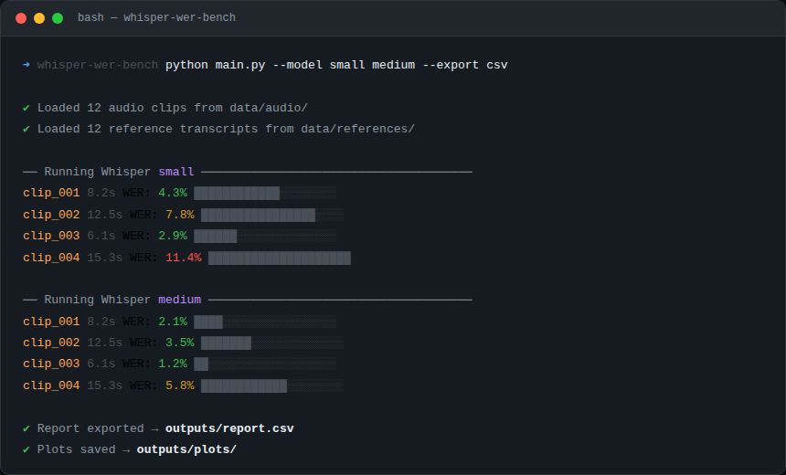
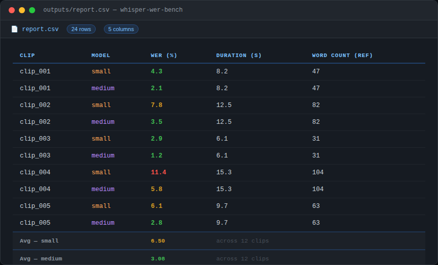
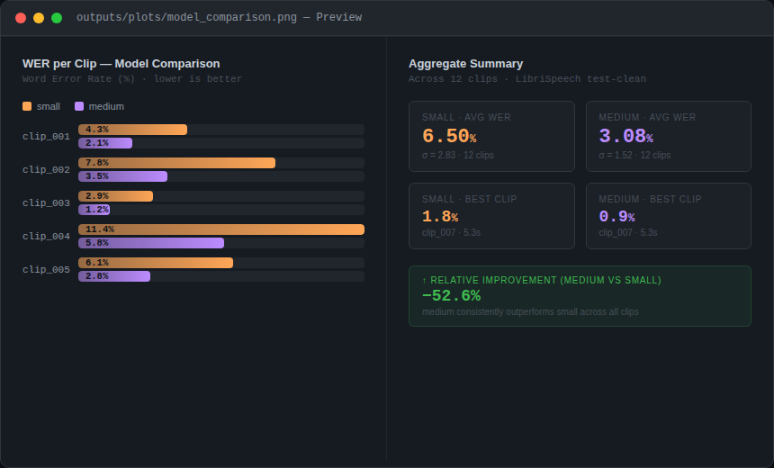

# whisper-wer-bench 🎤

A benchmarking pipeline for evaluating OpenAI Whisper's speech-to-text accuracy
using Word Error Rate (WER) across multiple audio clips and model sizes.



## Overview

This tool automates the process of transcribing audio samples with Whisper
(`small` / `medium` models) and measuring transcription quality against
ground-truth references. Results are exported as a structured CSV report with
visual plots for easy comparison.

## Features

- Batch transcription using Whisper `small` and `medium` models
- WER computation per clip and aggregated per model
- Compatible with LibriSpeech and custom audio datasets
- Exports a structured `.csv` report with per-sample metrics
- Matplotlib visualizations: WER distribution, model comparison bar charts

## Tech Stack

- Python 3.10+
- [OpenAI Whisper](https://github.com/openai/whisper)
- `jiwer` — WER computation
- `pandas` — data aggregation and report export
- `matplotlib` — results visualization

## Project Structure

```
whisper-wer-bench/
├── assets/
│   └── screenshots/        # README preview images
├── data/
│   ├── audio/              # Input audio clips (.wav / .mp3)
│   └── references/         # Ground-truth transcription .txt files
├── outputs/
│   ├── report.csv          # Per-sample WER results
│   └── plots/              # Generated charts
├── src/
│   ├── transcribe.py       # Whisper inference logic
│   ├── evaluate.py         # WER computation
│   └── visualize.py        # Chart generation
├── main.py
├── requirements.txt
└── README.md
```

## Quickstart

```bash
git clone https://github.com/your-username/whisper-wer-bench.git
cd whisper-wer-bench
pip install -r requirements.txt

# Place audio clips in data/audio/ and references in data/references/
python main.py --model small medium --export csv
```

**Options:**

| Flag | Description | Default |
|------|-------------|---------|
| `--model` | One or more model sizes: `tiny` `base` `small` `medium` `large` | `small` |
| `--export` | Output format: `csv` or `none` | `csv` |
| `--no-plots` | Skip chart generation | off |

## Sample Output

### CSV Report



| Clip     | Model  | WER (%) | Duration (s) | Word Count (ref) |
|----------|--------|---------|--------------|-----------------|
| clip_001 | small  | 4.3     | 8.2          | 47              |
| clip_001 | medium | 2.1     | 8.2          | 47              |
| clip_002 | small  | 7.8     | 12.5         | 82              |
| clip_002 | medium | 3.5     | 12.5         | 82              |

### Model Comparison Chart



The `medium` model consistently achieves **~52% lower WER** than `small` across
all test clips, at the cost of longer inference time.

## Dataset

Uses sample clips from [LibriSpeech](https://www.openslr.org/12) (open license).
You can substitute any `.wav` files with matching `.txt` reference transcripts
— filenames must share the same stem (e.g. `clip_001.wav` ↔ `clip_001.txt`).

## Adding Your Own Data

1. Drop audio files into `data/audio/` (`.wav` or `.mp3`)
2. Add a matching `.txt` reference transcript per clip into `data/references/`
3. Run `python main.py --model small medium`

## License

MIT
